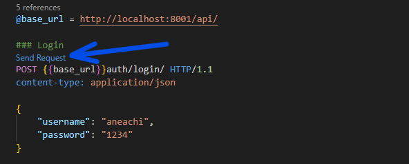

# PUBLICART 2.0 - BACKEND
Backend de la aplicación hecho con django rest framework para realizar consultas de forma sencilla desde el frontend.
 
Se ocupará de la lógica base y baja de la aplicación para mejorar el rendimiento de la aplicación y la parte del frontend de la aplicación reciba de manera rápida y efectiva los datos necesarios.

## Iniciar desde desarrollo
1. Activar entorno virtual. Ej.: `venv\Script\activate` 
2. Desplazarte al directorio del proyecto
3. Realizar las migraciones:
    1. `python manage.py makemigrations`
    1. `python manage.py migrate`
1. Iniciar servidor: `python manage.py runserver`

## Pruebas
Para realizar las pruebas de las consultas usar los ficheros **.http** con la extensión de visual studio [REST Client](https://marketplace.visualstudio.com/items?itemName=humao.rest-client).
 
Pulsar sobre **Send Request** para enviar la consulta

# Implementar
- Endpoints:
    - ~~AUTHENTICATION~~
    - ~~OBRA~~
    - ~~PUBLICACION~~
    - INTERACCION
    - TRANSACCION
- ~~Lógica login de usuarios~~
- Lógica registro de usuarios
- Mirar donde alojar la base de datos
- Cómo implementar GRUPOS